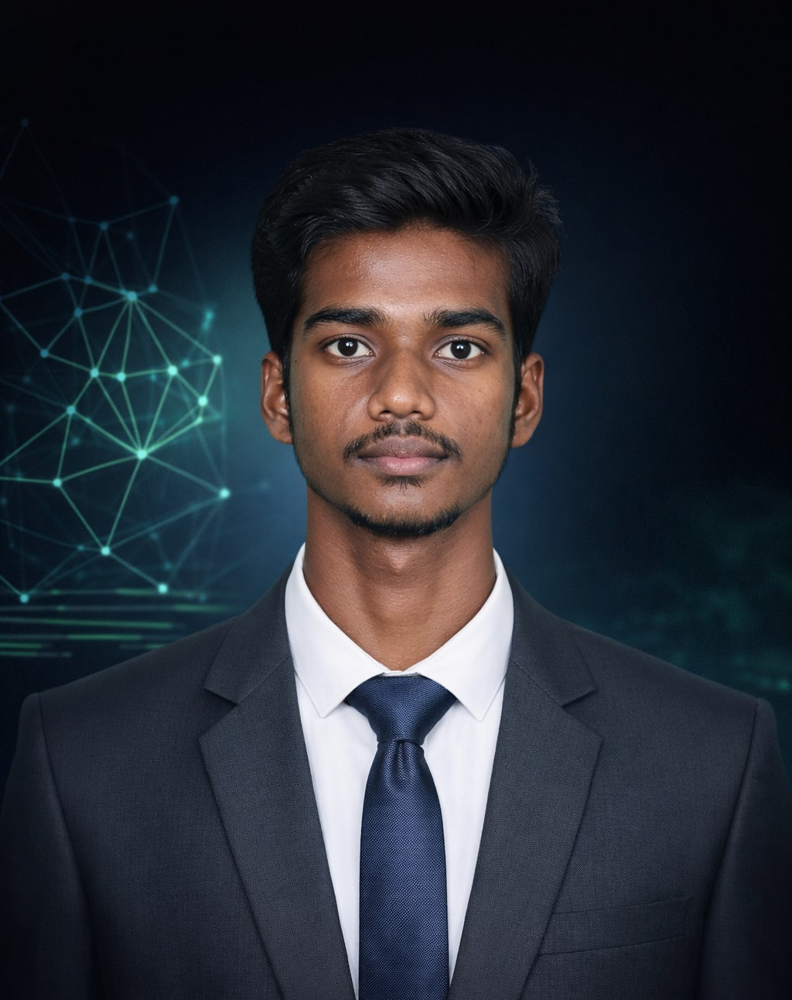

# 🚀 Somesh M – Developer Portfolio

Welcome to my personal portfolio website repository.  
This portfolio highlights my skills, projects, resume, and achievements as a **B.Tech Computer Science and Business Systems student** passionate about **software development, AI, and cybersecurity**.

🌐 **Live Portfolio:**  
👉 https://somesh-m.netlify.app/

---

# 👨‍💻 About Me

I am **Somesh M**, a Computer Science and Business Systems student from **VSB Engineering College, Tamil Nadu, India**.

I specialize in:

- Java Full Stack Development
- Python Development
- Machine Learning
- React & Web Technologies
- Cloud Computing

I enjoy building innovative projects that combine **AI, software development, and real-world problem solving**.

---

# 🛠 Tech Stack

### Programming Languages
- Java
- Python
- C

### Frameworks & Tools
- React
- Spring Boot
- Full Stack Development
- REST APIs

### Core Concepts
- Object Oriented Programming
- DBMS
- Web Development
- Machine Learning

---

# 📂 Projects Featured

Some of the projects showcased in this portfolio:

### 🧠 JeduAI
Smart learning and language empowerment platform powered by AI.

### 🚦 NeuroFleetX
AI-powered urban fleet and traffic intelligence system.

### 🎮 Java Text-Based Adventure Game
Interactive adventure game developed using Java.

### 🌱 AI Crop Recommendation System
Machine learning model that recommends crops based on soil and environmental conditions.

### 🧠 DiagnoraX
Your Personal AI Health Companion — A smart mobile application for health monitoring and AI-driven diagnostic assistance.

---

# 💼 Internships

- **Full Stack Development Intern – Nanda Info Tech**
- **Machine Learning Intern – Brainery Spot Technologies**
- **Cloud Computing Intern – Brainery Spot Technologies**

---

# 📄 Resume

My resume is embedded directly inside the portfolio and can be viewed or downloaded from the website.

---

# 🎨 Portfolio Features

✨ Modern animated UI  
✨ Custom cursor effects  
✨ Smooth scroll navigation  
✨ Interactive project cards  
✨ Resume viewer & download  
✨ Responsive design  

---

# 📷 Portfolio Preview

---

# 📬 Contact Me

📧 Email: someshm7662@gmail.com  
📍 Location: Karur, Tamil Nadu, India  

🔗 LinkedIn  
https://linkedin.com/in/somesh4206/

🔗 GitHub  
https://github.com/Somesh4206

---

# ⭐ Support

If you like this portfolio, please ⭐ the repository.

It motivates me to build more projects!